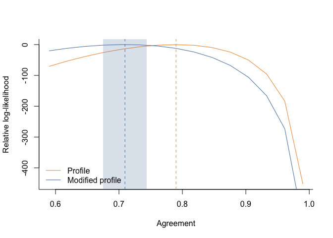

<!-- README.md is generated from README.Rmd. Please edit that file -->

# AgreementPhi

<!-- badges: start -->

[](https://github.com/giuseppealfonzetti/AgreementPhi/actions/workflows/R-CMD-check.yaml)
[](https://lifecycle.r-lib.org/articles/stages.html#experimental)
[](https://CRAN.R-project.org/package=AgreementPhi)

<!-- badges: end -->

The `AgreementPhi` package allows to accurately estimate the general
agreement among raters across a collection of items. It provides a
general tool to deal with percentage and ordinal data.

## Installation

You can install `AgreementPhi` using the `devtools` package:

``` r
devtools::install_github("giuseppealfonzetti/AgreementPhi")
```

## Example

Generate a synthetic dataset with continuous ratings in (0,1)

``` r
library(AgreementPhi)
set.seed(321)
# setting dimension
items <- 200
budget_per_item <- 5
n_obs <- items * budget_per_item

# item-specific intercepts to generate the data
alphas <- runif(items, -2, 2)

# true agreement (between 0 and 1)
agr <- .7

# generate continuous rating in (0,1)
dt <- sim_data(
  J = items,
  B = budget_per_item,
  AGREEMENT = agr,
  ALPHA = alphas
)
```

Fit the model using the `agreement()` function

``` r
# estimation via modified profile likelihood
fit <- agreement(
  RATINGS = dt$rating,
  ITEM_INDS = dt$id_item,
  WORKER_INDS = dt$id_worker,
  METHOD = "modified",
  NUISANCE = c("items"),
  VERBOSE = TRUE)
#> 
#> DATA
#>  - Detected 199 items and 200 workers.
#>  - Detected ordinal data on a 6-points scale.
#>  - Average number of observed ratings per item is 5.03.
#>  - Average number of observed ratings per worker is 5.
#> Average number of ratings per item is lower than reccomended
#> 
#> MODEL PARAMETERS
#>  - Constant effects: workers
#>  - Nuisance effects: items
#> Non-adjusted agreement: 0.786544
#> Adjusted agreement: 0.707372
#> Done!
```

Inference and plotting functions

``` r
# get standard error and confidence interval
ci <- get_ci(fit)
ci 
#> $agreement_est
#> [1] 0.7073723
#> 
#> $agreement_se
#> [1] 0.02246179
#> 
#> $agreement_ci
#> [1] 0.6633480 0.7513966
# compute log-likelihood over a grid
range_ll <- get_range_ll(fit)

# utility plot function for relative log-likelihood
plot_rll(
  D=range_ll, 
  M_EST = fit$modified$agreement,
  P_EST = fit$profile$agreement,
  M_SE = ci$agreement_se,
  CONFIDENCE=.95
)
```


