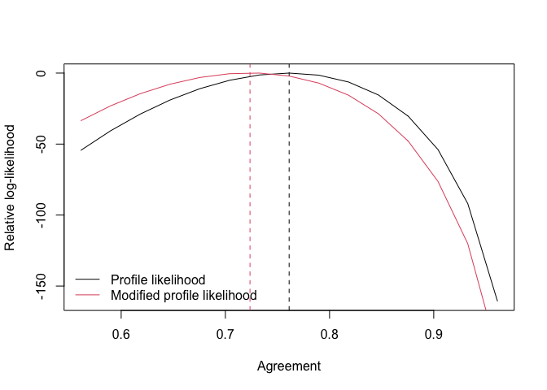

<!-- README.md is generated from README.Rmd. Please edit that file -->

# AgreementPhi

<!-- badges: start -->

[](https://github.com/giuseppealfonzetti/AgreementPhi/actions/workflows/R-CMD-check.yaml)
[](https://lifecycle.r-lib.org/articles/stages.html#experimental)
[](https://CRAN.R-project.org/package=AgreementPhi)

<!-- badges: end -->

The `AgreementPhi` package allows to accurately estimate the general
agreement among raters across a collection of items. It provides a
general tool to deal with percentage and ordinal data.

## Installation

You can install `AgreementPhi` using the `devtools` package:

``` r
devtools::install_github("giuseppealfonzetti/AgreementPhi")
```

## Example

Generate a synthetic dataset with continuous ratings in (0,1)

``` r
library(AgreementPhi)
set.seed(123)

# setting dimension
items <- 100 
budget_per_item <- 10
n_obs <- items * budget_per_item

# item-specific intercepts to generate the data
alphas <- runif(items, -1, 1)

# true agreement (between 0 and 1)
agr <- .7

# generate continuous rating in (0,1)
dt <- sim_data(
  J = items,
  B = budget_per_item,
  AGREEMENT = agr,
  ALPHA = alphas,
  DATA_TYPE = "continuous",
  SEED = 123
)
```

We fit the model on the continuous ratings data and compare the
agreement estimated between diffferent methods

``` r
# fit via profile likelihood
fit_c_p <- agreement(
  RATINGS = dt$rating,
  ITEM_INDS = dt$id_item,
  METHOD = "profile",
  VERBOSE = TRUE)
#> Detected 100 non-degenerate items.
#> Detected continuous data on the (0,1) range.
#> Average number of observed ratings per item is 10.
#> Fitting oneway model:
fit_c_p$pl_agreement
#> [1] 0.7513042

# fit via modified profile likelihood
fit_c_mp <- agreement(
  RATINGS = dt$rating,
  ITEM_INDS = dt$id_item,
  METHOD = "modified")
fit_c_mp$mpl_agreement
#> [1] 0.7131472
```

We can plot the relative loglikelihood profiles

``` r
rll <- get_rll(fit_c_mp, PLOT = TRUE)
```


and also construct confidence intervals for the estimated agreement

``` r
get_ci(fit_c_mp)$agreement_ci
#> [1] 0.6821001 0.7441943
```

Consider now ratings collected on Likert-type rating. To allow for a
direct comparison with the previous dataset, we directly discretise the
continuous ratings generated previously

``` r
rating_k3 <- cont2ord(dt$rating, K=3)
rating_k6 <- cont2ord(dt$rating, K=6)
```

Now, we evaluate the agreement on the discretised data. The fitting
function automatically detects the ordinal ratings scale.

``` r
fit_k3_p <- agreement(
  RATINGS = rating_k3,
  ITEM_INDS = dt$id_item,
  METHOD = "profile")
fit_k3_p$pl_agreement
#> [1] 0.7464581

fit_k3_mp <- agreement(
  RATINGS = rating_k3,
  ITEM_INDS = dt$id_item,
  METHOD = "modified")
fit_k3_mp$mpl_agreement
#> [1] 0.7031369

fit_k6_p <- agreement(
  RATINGS = rating_k6,
  ITEM_INDS = dt$id_item,
  METHOD = "profile")
fit_k6_p$pl_agreement
#> [1] 0.7611951

fit_k6_mp <- agreement(
  RATINGS = rating_k6,
  ITEM_INDS = dt$id_item,
  METHOD = "modified")
fit_k6_mp$mpl_agreement
#> [1] 0.723635
```

Also in case of ordinal data we can plot the profiles of the relative
log-likelihoods

``` r
rll <- get_rll(fit_k6_mp, PLOT = TRUE)
```



and construct confidence intervals

``` r
get_ci(fit_k3_mp)$agreement_ci
#> [1] 0.6483886 0.7578851
get_ci(fit_k6_mp)$agreement_ci
#> [1] 0.6874854 0.7597847
```

### TWO-WAY

Consider data generated according to the two-way model. Fitting a
one-way specification will likely result in underestimating the
agreement

``` r
set.seed(123)

# setting dimension
items <- 100 
budget_per_item <- 10
workers <- 20
n_obs <- items * budget_per_item

# item-specific intercepts to generate the data
alphas <- runif(items, -1, 1)
betas <- c(0, runif(workers-1, -1, 1))
# true agreement (between 0 and 1)
agr <- .9

# generate continuous rating in (0,1)
dt_twoway <- sim_data(
  J = items,
  B = budget_per_item,
  W = workers,
  AGREEMENT = agr,
  ALPHA = alphas,
  BETA = betas,
  DATA_TYPE = "continuous",
  SEED = 123
)

# estimation via oneway specification
fit_c_oneway <- agreement(
  RATINGS = dt_twoway$rating,
  ITEM_INDS = dt_twoway$id_item,
  METHOD = "modified",
  MODEL = "oneway",
  VERBOSE = TRUE)
#> Detected 100 non-degenerate items.
#> Detected continuous data on the (0,1) range.
#> Average number of observed ratings per item is 10.
#> Fitting oneway model:
#> Non-adjusted agreement: 0.750032
#> Adjusted agreement: 0.711846

# estimation via twoway specification
fit_c_twoway <- agreement(
  RATINGS = dt_twoway$rating,
  ITEM_INDS = dt_twoway$id_item,
  WORKER_INDS = dt_twoway$id_worker,
  METHOD = "modified",
  MODEL = "twoway",
  VERBOSE = TRUE)
#> Detected 100 items and 20 workers.
#> Detected continuous data on the (0,1) range.
#> Average number of observed ratings per item is 10.
#> Average number of observed ratings per worker is 50.
#> Fitting twoway model:
#> Non-adjusted agreement: 0.9384
#> Adjusted agreement: 0.9135

# estimation via twoway specification | ordinal data
fit_k6_twoway <- agreement(
  RATINGS = cont2ord(dt_twoway$rating, K=6),
  ITEM_INDS = dt_twoway$id_item,
  WORKER_INDS = dt_twoway$id_worker,
  METHOD = "modified",
  MODEL = "twoway",
  VERBOSE = TRUE)
#> Detected 100 items and 20 workers.
#> Detected ordinal data on a 6-points scale.
#> Average number of observed ratings per item is 10.
#> Average number of observed ratings per worker is 50.
#> Fitting twoway model:
#> Non-adjusted agreement: 0.9281
#> Adjusted agreement: 0.8971
```

Consider now data generated according to the one-way model. Fitting
one-way and two-way specifications will likely result in similar
estimates of the agreement.

``` r
set.seed(123)

# setting dimension
items <- 100 
budget_per_item <- 10
n_obs <- items * budget_per_item

# item-specific intercepts to generate the data
alphas <- runif(items, -1, 1)

# true agreement (between 0 and 1)
agr <- .9

# generate continuous rating in (0,1)
dt_oneway <- sim_data(
  J = items,
  B = budget_per_item,
  AGREEMENT = agr,
  ALPHA = alphas,
  W=20,
  DATA_TYPE = "continuous",
  SEED = 123
)

# estimation via oneway specification
fit_c_oneway <- agreement(
  RATINGS = dt_oneway$rating,
  ITEM_INDS = dt_oneway$id_item,
  METHOD = "modified",
  MODEL = "oneway",
  VERBOSE = TRUE)
#> Detected 100 non-degenerate items.
#> Detected continuous data on the (0,1) range.
#> Average number of observed ratings per item is 10.
#> Fitting oneway model:
#> Non-adjusted agreement: 0.928871
#> Adjusted agreement: 0.907011

# estimation via twoway specification
fit_c_twoway <- agreement(
  RATINGS = dt_oneway$rating,
  ITEM_INDS = dt_oneway$id_item,
  WORKER_INDS = dt_oneway$id_worker,
  METHOD = "modified",
  MODEL = "twoway",
  VERBOSE = TRUE)
#> Detected 100 items and 20 workers.
#> Detected continuous data on the (0,1) range.
#> Average number of observed ratings per item is 10.
#> Average number of observed ratings per worker is 50.
#> Fitting twoway model:
#> Non-adjusted agreement: 0.9335
#> Adjusted agreement: 0.9078

# estimation via twoway specification | ordinal data
fit_k6_twoway <- agreement(
  RATINGS = cont2ord(dt_oneway$rating, K=6),
  ITEM_INDS = dt_oneway$id_item,
  WORKER_INDS = dt_oneway$id_worker,
  METHOD = "modified",
  MODEL = "twoway",
  VERBOSE = TRUE)
#> Detected 100 items and 20 workers.
#> Detected ordinal data on a 6-points scale.
#> Average number of observed ratings per item is 10.
#> Average number of observed ratings per worker is 50.
#> Fitting twoway model:
#> Non-adjusted agreement: 0.9317
#> Adjusted agreement: 0.9033
```
