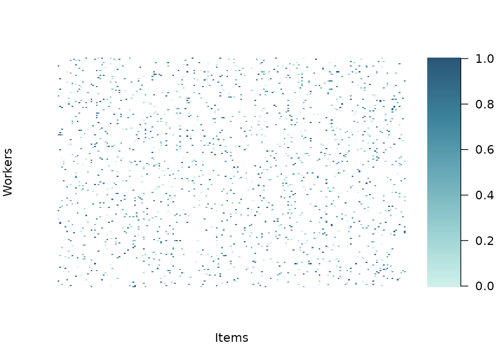
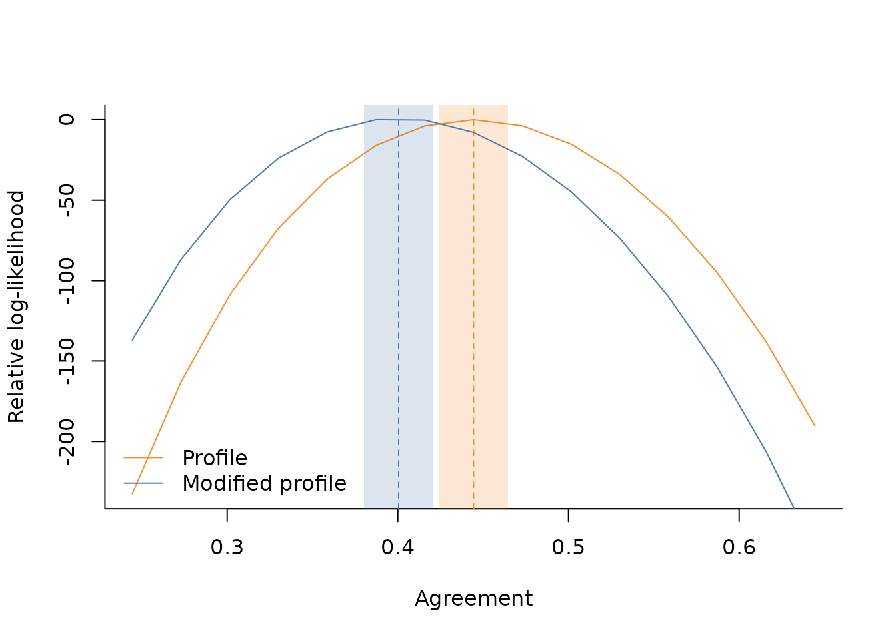

# Intoduction

## Basic usage

The `AgreementPhi` package exports a utility function to simulate data
by providing the true agreement and item effects. Consider for example
to simulate continuous ratings for 200 items, collecting 8 relevance
assessments per item, for a total of 1600 responses. We set the true
agreement at $\Phi = 0.4$

``` r
library(AgreementPhi)
set.seed(321)
# setting dimension
items <- 200
budget_per_item <- 8
n_obs <- items * budget_per_item

# item-specific intercepts to generate the data
alphas <- runif(items, -1, 1)

# true agreement (between 0 and 1)
agr <- .4

# generate continuous rating in (0,1)
dt <- sim_data(
  J = items,
  B = budget_per_item,
  AGREEMENT = agr,
  DATA_TYPE = "continuous",
  ALPHA = alphas
)
```

The simulated 1600 ratings are stored in `dt$ratings`, while
`dt$id_item` and `dt$id_worker` store the item and worker indices
related to each rating

``` r
names(dt)
#> [1] "id_item"   "id_worker" "rating"
head(dt$id_item)
#> [1] 20 44 45 51 83 92
head(dt$id_worker)
#> [1] 1 1 1 1 1 1
head(dt$rating)
#> [1] 0.6375834 0.7420828 0.9866412 0.4995354 0.2111970 0.0271688
length(dt$rating)
#> [1] 1600
```

For convenience, we also provide a plot utility to visualise the data

``` r
plot_data(
  RATINGS = dt$rating,
  ITEM_INDS = dt$id_item,
  WORKER_INDS = dt$id_worker
)
```



The core function of the `AgreementPhi` package is
[`agreement()`](https://giuseppealfonzetti.github.io/AgreementPhi/reference/agreement.md),
which implements the numerical algorithms to estimate the $\Phi$
agreement via profile and modified profile likelihood methods. It
requires as input the ratings, the item ids and worker ids (specified as
integers). For the estimation via profile likelihood, you can specify
`METHOD="profile"`

``` r
# estimation via profile likelihood
fit_profile <- agreement(
  RATINGS = dt$rating,
  ITEM_INDS = dt$id_item,
  WORKER_INDS = dt$id_worker,
  NUISANCE = c("items"),
  METHOD = "profile",
  VERBOSE = TRUE)
#> 
#> DATA
#>  - Detected 200 items and 200 workers.
#>  - Detected continuous data on the (0,1) range.
#>  - Average number of observed ratings per item is 8.
#>  - Average number of observed ratings per worker is 8.
#> 
#> MODEL PARAMETERS
#>  - Constant effects: workers
#>  - Nuisance effects: items
#> Done!
```

When the `VERBOSE` option is chosen, the function prints on screen some
useful information about data dimensions and sparsity. In addition, it
also provides an overview of how items and worker effects are treated.
In this case, for example, worker effects are considered as constant
(set at zero by default), while items effects are profiled out as
nuisance parameters. The agreement and precision estimates are available
at

``` r
fit_profile$profile
#> $precision
#> [1] 2.446563
#> 
#> $agreement
#> [1] 0.4444125
```

while the maximum likelihood estimates of the nuisance parameters are
available at

``` r
head(fit_profile$alpha)
#> [1]  1.0698711  1.4333241 -0.2898244 -0.9135686  0.3879414  0.1008767
```

To use the modified likelihood approach, it is enough to change the
`METHOD` argument to `modified`.

``` r
# estimation via modified profile likelihood
fit_modified <- agreement(
  RATINGS = dt$rating,
  ITEM_INDS = dt$id_item,
  WORKER_INDS = dt$id_worker,
  NUISANCE = c("items"),
  METHOD = "modified",
  VERBOSE = TRUE)
#> 
#> DATA
#>  - Detected 200 items and 200 workers.
#>  - Detected continuous data on the (0,1) range.
#>  - Average number of observed ratings per item is 8.
#>  - Average number of observed ratings per worker is 8.
#> 
#> MODEL PARAMETERS
#>  - Constant effects: workers
#>  - Nuisance effects: items
#> Non-adjusted agreement: 0.444413
#> Adjusted agreement: 0.400506
#> Done!
```

As it can be read from the verbose output, when `METHOD = "modified"`,
the proposed algorithm first optimises the profile likelihood to
evaluate the maximum likelihood estimators needed to construct the
modified profile likelihood. Thus, both estimates can be retrieved from
the fitted object

``` r
fit_modified$profile
#> $precision
#> [1] 2.446563
#> 
#> $agreement
#> [1] 0.4444125
fit_modified$modified
#> $precision
#> [1] 2.129948
#> 
#> $agreement
#> [1] 0.4005064
```

Once the point estimates are computed, we can draw inference on
agreement by using the
[`get_ci()`](https://giuseppealfonzetti.github.io/AgreementPhi/reference/get_ci.md)
function to construct confidence intervals. The function will
automatically recognise if the estimates are related to the profile or
modified likelihood approach by looking at the fitted object

``` r
# get standard error and confidence interval
ci_profile <- get_ci(fit_profile)
ci_profile
#> $agreement_est
#> [1] 0.4444125
#> 
#> $agreement_se
#> [1] 0.0102727
#> 
#> $agreement_ci
#> [1] 0.4242784 0.4645467

ci_modified <- get_ci(fit_modified)
ci_modified 
#> $agreement_est
#> [1] 0.4005064
#> 
#> $agreement_se
#> [1] 0.0103424
#> 
#> $agreement_ci
#> [1] 0.3802357 0.4207772
```

For convenience, we provide a utility function to visualise the relative
log-likelihood profiles of the two methods as well as the inference
results

``` r
# compute log-likelihood over a grid
range_ll <- get_range_ll(fit_modified)

# utility plot function for relative log-likelihood
plot_rll(
  D=range_ll,
  M_EST = fit_modified$modified$agreement,
  P_EST = fit_profile$profile$agreement,
  M_SE = ci_modified$agreement_se,
  P_SE = ci_profile$agreement_se,
  CONFIDENCE=.95
)
```


