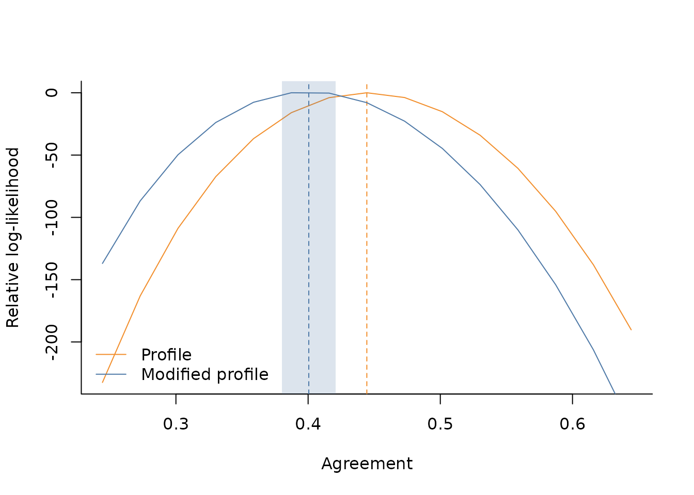

# Intoduction

## Basic usage

The `AgreementPhi` package exports a utility function to simulate data
by providing the true agreement and item effects. Consider for example
to simulate continuous ratings for 200 items, collecting 8 relevance
assessments per item, for a total of 1600 responses. We set the true
agreement at $`\Phi=0.4`$

``` r

library(AgreementPhi)
set.seed(321)
items <- 200
budget_per_item <- 8
alphas <- runif(items, -1, 1)
agr <- .4

dt <- sim_data(
  J = items,
  B = budget_per_item,
  AGREEMENT = agr,
  DATA_TYPE = "continuous",
  ALPHA = alphas
)
```

The simulated 1600 ratings are stored in `dt$ratings`, while
`dt$id_item` and `dt$id_worker` store the item and worker indices
related to each rating

``` r

names(dt)
#> [1] "id_item"   "id_worker" "rating"
head(dt$id_item)
#> [1] 20 44 45 51 83 92
head(dt$id_worker)
#> [1] 1 1 1 1 1 1
head(dt$rating)
#> [1] 0.6375834 0.7420828 0.9866412 0.4995354 0.2111970 0.0271688
length(dt$rating)
#> [1] 1600
```

Use
[`rating_data()`](https://giuseppealfonzetti.github.io/AgreementPhi/reference/rating_data.md)
to validate the input and construct a `rating_data` object. The function
reports diagnostics and supports a
[`plot()`](https://rdrr.io/r/graphics/plot.default.html) method

``` r

rd <- rating_data(dt$rating, dt$id_item, dt$id_worker)
#>  - Detected 200 items and 200 workers.
#>  - Detected continuous data on the (0,1) range.
#>  - Average number of observed ratings per item is 8.
#>  - Average number of observed ratings per worker is 8.
```

``` r

plot(rd)
```


The core function of the `AgreementPhi` package is
[`agreement()`](https://giuseppealfonzetti.github.io/AgreementPhi/reference/agreement.md),
which implements the numerical algorithms to estimate the $`\Phi`$
agreement via profile and modified profile likelihood methods. It takes
a `rating_data` object as its first argument. For the estimation via
profile likelihood, you can specify `METHOD="profile"`

``` r

fit_profile <- agreement(rd, NUISANCE = c("items"), METHOD = "profile", VERBOSE = TRUE)
#> 
#> MODEL PARAMETERS
#>  - Constant effects: workers
#>  - Nuisance effects: items
#> Done!
```

When the `VERBOSE` option is chosen, an overview of how items and worker
effects are treated is printed. In this case, for example, worker
effects are considered as constant (set at zero by default), while items
effects are profiled out as nuisance parameters.

Estimated coefficients can be extracted via
[`coef()`](https://rdrr.io/r/stats/coef.html) method

``` r

coef(fit_profile)[1:5]
#>        phi    alpha_1    alpha_2    alpha_3    alpha_4 
#>  2.4465627  1.0698711  1.4333241 -0.2898244 -0.9135686
length(coef(fit_profile))
#> [1] 201
```

To use the modified likelihood approach, it is enough to change the
`METHOD` argument to `modified`.

``` r

fit_modified <- agreement(rd, NUISANCE = c("items"), METHOD = "modified", VERBOSE = TRUE)
#> 
#> MODEL PARAMETERS
#>  - Constant effects: workers
#>  - Nuisance effects: items
#> Non-adjusted agreement: 0.444413
#> Adjusted agreement: 0.400505
#> Done!
```

As it can be read from the verbose output, when `METHOD = "modified"`,
the proposed algorithm first optimises the profile likelihood to
evaluate the maximum likelihood estimators needed to construct the
modified profile likelihood. Also in this case you can access estimates
using [`coef()`](https://rdrr.io/r/stats/coef.html)

``` r

coef(fit_profile)[1:5]
#>        phi    alpha_1    alpha_2    alpha_3    alpha_4 
#>  2.4465627  1.0698711  1.4333241 -0.2898244 -0.9135686
length(coef(fit_profile))
#> [1] 201
```

Once the point estimates are computed, we can draw inference on
agreement by using the
[`confint()`](https://rdrr.io/r/stats/confint.html) S3 method to
construct confidence intervals. The function will automatically
recognise if the estimates are related to the profile or modified
likelihood approach by looking at the fitted object

``` r

ci_profile <- confint(fit_profile)
ci_profile
#> $parameters
#>     Estimate Std. Error    2.5 %   97.5 %
#> phi 2.446563 0.07696817 2.295708 2.597418
#> 
#> $agreement
#>            Estimate Std. Error     2.5 %    97.5 %
#> agreement 0.4444125  0.0102727 0.4242784 0.4645466

ci_modified <- confint(fit_modified)
ci_modified
#> $parameters
#>     Estimate Std. Error    2.5 %   97.5 %
#> phi 2.129941 0.07181497 1.989187 2.270696
#> 
#> $agreement
#>            Estimate Std. Error     2.5 %    97.5 %
#> agreement 0.4005054  0.0103424 0.3802347 0.4207762
```

For convenience,
[`plot()`](https://rdrr.io/r/graphics/plot.default.html) visualises the
relative log-likelihood profile and confidence interval in one step

``` r

plot(fit_modified)
```


If you need the grid data for further analysis, compute it with
[`get_range_ll()`](https://giuseppealfonzetti.github.io/AgreementPhi/reference/get_range_ll.md)
and pass it back to
[`plot()`](https://rdrr.io/r/graphics/plot.default.html) to avoid
recomputation

``` r

range_ll <- get_range_ll(fit_modified)
plot(fit_modified, RANGE_LL = range_ll)
```


