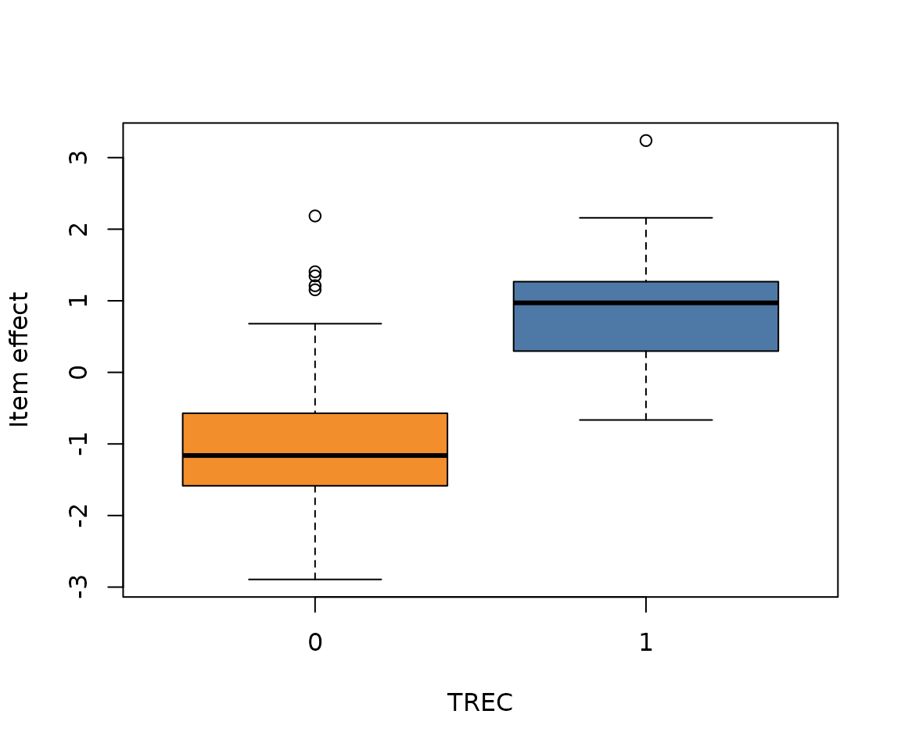

# Analysing crowdsourced relevance assessments (Roitero et al. 2021)

## The data

The `roitero2021` dataset is a subset of the crowdsourcing experiment in
Roitero et al. (2021), restricted to assessments collected on the
100-point continuous (S100) relevance scale. Each row is one worker’s
`relevance_score` for one `document_id` within a `topic_id`. The data
are fetched on demand from the [upstream
repository](https://github.com/KevinRoitero/CrowdsourcingRelevanceScales).

``` r

roitero2021 <- download_roitero2021()
str(roitero2021)
#> 'data.frame':    56472 obs. of  11 variables:
#>  $ topic_id       : int  445 445 445 445 445 445 445 445 445 445 ...
#>  $ unit_id        : int  0 0 0 0 0 0 0 0 1 1 ...
#>  $ document_id    : chr  "FT941-7858" "FT941-5312" "FT943-9241" "FT924-8156" ...
#>  $ gold           : chr  "null" "null" "null" "H" ...
#>  $ doc_pos        : int  0 1 2 3 4 5 6 7 0 1 ...
#>  $ worker_id      : chr  "gAAAAABgpOXVqNEjGuhKGPD07r9ZE4aIETRpKrbp78KF-qmEVxiruzngZVFS7Y8DuOGnqYngOpkQ-CtyeHxF6fZ_kiP-RCn9Gw==" "gAAAAABgpOXVqNEjGuhKGPD07r9ZE4aIETRpKrbp78KF-qmEVxiruzngZVFS7Y8DuOGnqYngOpkQ-CtyeHxF6fZ_kiP-RCn9Gw==" "gAAAAABgpOXVqNEjGuhKGPD07r9ZE4aIETRpKrbp78KF-qmEVxiruzngZVFS7Y8DuOGnqYngOpkQ-CtyeHxF6fZ_kiP-RCn9Gw==" "gAAAAABgpOXVqNEjGuhKGPD07r9ZE4aIETRpKrbp78KF-qmEVxiruzngZVFS7Y8DuOGnqYngOpkQ-CtyeHxF6fZ_kiP-RCn9Gw==" ...
#>  $ relevance_score: num  100 60 0 100 75 0 0 0 98 0 ...
#>  $ cumulative_time: num  49.1 72 33.9 26.9 55.2 ...
#>  $ comment        : chr  "It's about women as priests in England, spot on." "A small part of the text is about it \"Women priests Saturday sees the first ordination in Britain of women pri"| __truncated__ "Nothing at all to be found." "Once again about female priests in England, completely relevant." ...
#>  $ trec           : int  1 0 1 1 1 0 0 0 1 0 ...
#>  $ sormunen       : int  2 NA 0 3 1 0 NA NA 1 0 ...
```

For simplicity, here we focus on a single topic and look at how the
related items were assessed.

``` r

topic <- subset(roitero2021, topic_id == 428)
nrow(topic)
#> [1] 3352
```

We retain only workers who “correctly” responded to the gold items
(high-relevance `"H"` above threshold and non-relevant `"N"` below
threshold) and then keep only non-gold items.

``` r


select_workers <- intersect(
  unique(topic[topic$relevance_score > 50 & topic$gold == "H", ]$unit_id),
  unique(topic[topic$relevance_score < 50 & topic$gold == "N", ]$unit_id)
)

topic <- subset(topic, unit_id %in% select_workers & gold == "null")
nrow(topic)
#> [1] 2196
```

As scores were collected on a 0–100 scale, we map them onto `[0,1]` by
simply dividing by 100. To build a `rating_data` object we use the
[`rating_data()`](https://giuseppealfonzetti.github.io/AgreementPhi/reference/rating_data.md)
function. Since exact 0s and 100s are present in the data, the function
automatically detects the inflated beta ratings.

``` r

ratings <- topic$relevance_score / 100
items <- as.integer(factor(topic$document_id))
rd <- rating_data(ratings, items)
rd
#> - Data type: inflated 
#> - Inflation: zeros = 38.3% / ones = 7.6% 
#> - Items: 251 ( 2 degenerate )
#> - Average budget per item: 8.75 
#> - n: 2196
```

As printed, the checks detected two degenerate items. These correspond
to documents where the same value is given by all raters

``` r

degen_docs <- levels(factor(topic$document_id))[rd$degen_ids]
d <- subset(topic, document_id %in% degen_docs, select = c(document_id, relevance_score))
d[order(d$document_id), ]
#>             document_id relevance_score
#> 115931 FR941121-0-00035               0
#> 116340 FR941121-0-00035               0
#> 116533 FR941121-0-00035               0
#> 116795 FR941121-0-00035               0
#> 117104 FR941121-0-00035               0
#> 117660 FR941121-0-00035               0
#> 117872 FR941121-0-00035               0
#> 118732 FR941121-0-00035               0
#> 118929 FR941121-0-00035               0
#> 115886    LA013190-0096               0
#> 116191    LA013190-0096               0
#> 116685    LA013190-0096               0
#> 117054    LA013190-0096               0
#> 117096    LA013190-0096               0
#> 117619    LA013190-0096               0
#> 118195    LA013190-0096               0
#> 118406    LA013190-0096               0
```

## Fitting the agreement model

The inflated interval model is a one-way model: the item effects are
profiled out as nuisance parameters. The argument `METHOD = "modified"`
denotes that the modified profile likelihood is used for estimation

``` r

fit <- agreement(rd, NUISANCE = "items", METHOD = "modified")
```

We can extract estimated coefficients with the familiar
[`coef()`](https://rdrr.io/r/stats/coef.html) method

``` r

coef(fit)[1:10]
#>        phi         k0         k1    alpha_1    alpha_2    alpha_3    alpha_4 
#>  2.6944238 -1.3789283  2.3437713  0.4646532  0.9665874  1.9666077 -0.9659125 
#>    alpha_5    alpha_6    alpha_7 
#> -0.8590840 -1.1937944 -0.2065705
```

where alphas for degenrate items are reported with infinite values

``` r

coef(fit)[paste0("alpha_", rd$degen_ids)]
#> alpha_138 alpha_199 
#>      -Inf      -Inf
```

The [`confint()`](https://rdrr.io/r/stats/confint.html) method returns
the confidence intervals for parameter estimates (`phi`, `k0`, `k1`) as
well as for agreement. Note that, for the latter, intervals are
constructed via delta method

``` r

confint(fit)
#> $parameters
#>      Estimate Std. Error     2.5 %    97.5 %
#> phi  2.694424 0.10667435  2.485346  2.903502
#> k0  -1.378928 0.06127626 -1.499028 -1.258829
#> k1   2.343771 0.09483957  2.157889  2.529653
#> 
#> $agreement
#>            Estimate Std. Error     2.5 %    97.5 %
#> agreement 0.4765281 0.01341449 0.4502362 0.5028201
```

## Item effects

The original data also contain TREC labels, which correspond to
evaluations given by experts on a binary scale (relevant = 1 /
non-relevant = 0). We can plot the estimated $`\alpha`$ vector to
visualise how the model captured the different relevance levels across
items

``` r

doc_levels <- levels(factor(topic$document_id))
alphas <- coef(fit)[grep("^alpha", names(coef(fit)))]
trec <- tapply(topic$trec, topic$document_id, function(x) x[!is.na(x)][1])
boxplot(
  alphas ~ factor(trec[doc_levels]),
  xlab = "TREC", 
  ylab = "Item effect",
  col = c("#F28E2B", "#4E79A7"))
#> Warning in bplt(at[i], wid = width[i], stats = z$stats[, i], out =
#> z$out[z$group == : Outlier (-Inf) in boxplot 1 is not drawn
```



``` r

p_degen <- confint_prob_degenerate(fit)
plot_prob_degenerate(fit)
```


